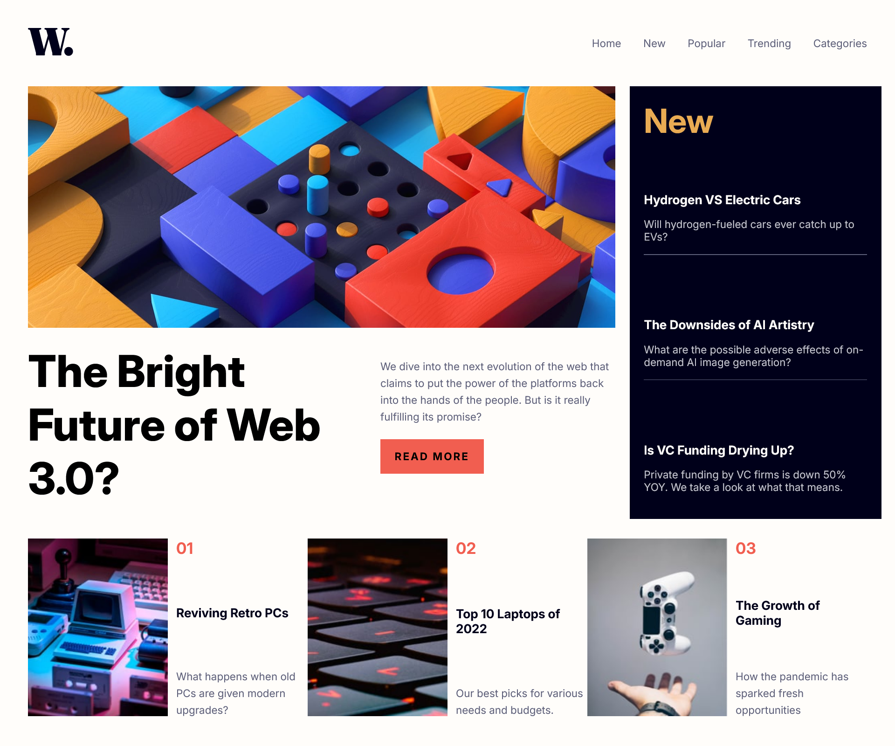

# Frontend Mentor - News homepage solution

This is a solution to the [News homepage challenge on Frontend Mentor](https://www.frontendmentor.io/challenges/news-homepage-H6SWTa1MFl). Frontend Mentor challenges help you improve your coding skills by building realistic projects.

## Table of contents

- [Overview](#overview)
  - [The challenge](#the-challenge)
  - [Screenshot](#screenshot)
  - [Links](#links)
- [My process](#my-process)
  - [Built with](#built-with)
  - [What I learned](#what-i-learned)
  - [Continued development](#continued-development)
  - [AI Collaboration](#ai-collaboration)
- [Author](#author)

## Overview

### The challenge

Users should be able to:

- View the optimal layout for the interface depending on their device's screen size
- See hover and focus states for all interactive elements on the page

### Screenshot



### Links

- [Solution URL](https://www.frontendmentor.io/solutions/news-homepage-html-css-js-lZjEaKsZkD)
- [Live site URL](https://limsael.github.io/news-homepage/)

## My process

### Built with

- Semantic HTML5 markup
- CSS custom properties
- Flexbox
- CSS Grid
- SCSS

### What I learned

```js
function handleImageChange(e) {
  if (e.matches) {
    mainFeaturedImage.src = "../assets/images/image-web-3-mobile.jpg";
  } else {
    mainFeaturedImage.src = "../assets/images/image-web-3-desktop.jpg";
  }
}
```

### Continued development

- The backdrop when the navbar is visible on smaller screens.
- The navbar design on smaller screens (maybe make it more efficient).

### AI Collaboration

- VS Code auto completion.

## Author

- Frontend Mentor - [@limsael](https://www.frontendmentor.io/profile/limsael)
